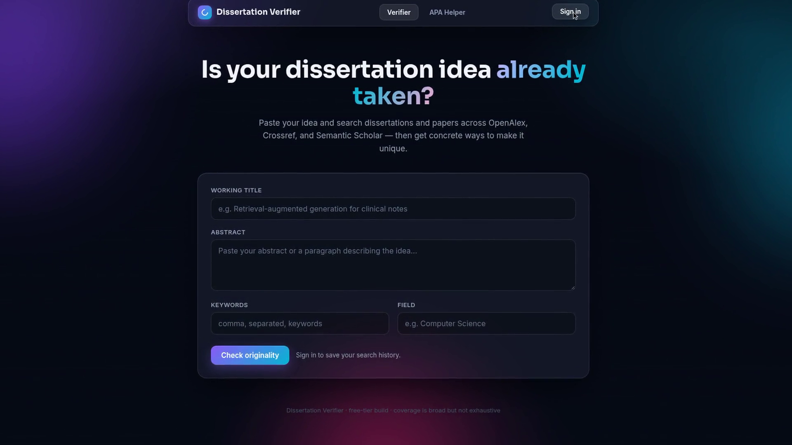

# Dissertation Verifier

Is your PhD dissertation idea already taken? Type in a working title, abstract, and keywords — then see matching dissertations and papers with links, get concrete suggestions for making your idea unique, and format your references in APA 7th.

**Live app:** https://dissertation-verifier.pages.dev/

## Demo

<p align="center">
  <a href="https://github.com/suhasaitham22/dissertation-verifier/releases/download/demo/dissertation-verifier-demo.mp4"></a>
</p>

**What this project does:** Dissertation Verifier is a free web app for PhD students to check whether their dissertation idea is already taken. Type a working title, abstract, and keywords — it searches dissertations and papers across OpenAlex, Crossref, and Semantic Scholar, shows ranked matches with links plus an overall overlap verdict, warns you if you've already explored a similar idea (AI-powered duplicate detection), suggests concrete ways to make your idea unique, and formats your references in APA 7th.

**What the video shows** — a narrated, ~80-second walkthrough recorded on the live app (not a slideshow):
1. Signing up and signing in
2. Running an originality check on a crowded topic → 25 matching works with a "High overlap" verdict
3. Duplicate detection flagging an 88%-similar paraphrase of an earlier idea
4. AI-generated uniqueness gaps with concrete differentiation angles
5. The APA 7th helper formatting a reference and flagging missing fields

## Features

- **Originality check** — searches dissertations and papers across OpenAlex, Crossref, and Semantic Scholar. Results are deduplicated, ranked, and shown as glassy cards with source pills, links, abstracts, matched keywords, and relevance bars — plus an overall overlap verdict.
- **Duplicate detection** — every search is embedded and compared (pgvector cosine similarity) against your own past ideas. If you re-check a paraphrased version of something you already explored, you'll get a "Heads up — N% similar" notice instead of a false sense of novelty.
- **Uniqueness gaps** — an LLM reads your idea alongside the top matches and suggests 3–5 concrete differentiation angles (new population, method, context, dataset…), with a summary of what the literature already covers.
- **APA 7th helper** — a second tab with templates for journal articles, books, dissertations/theses, conference papers, and webpages: fill the fields, get a formatted reference with italics, copy it as plain text, and see missing-field warnings. A messy-reference parser extracts authors/year/title/source from pasted text and flags what it couldn't detect.
- **Private by design** — email auth via Supabase; row-level security means you only ever see your own ideas and history.

## Architecture (100% free tier)

| Piece | Service | Free-tier usage |
|---|---|---|
| Frontend | Cloudflare Pages (static) | Unlimited static hosting |
| API | Cloudflare Workers | 100k req/day |
| Embeddings | Workers AI `bge-base-en-v1.5` (768-dim) | 10k neurons/day |
| Gap-analysis LLM | Workers AI `llama-3.1-8b-instruct-fp8` | 10k neurons/day |
| Database + Auth | Supabase (Postgres + pgvector) | Free plan |
| Code | GitHub | Free |

No build step, no paid add-ons, no API keys to manage.

## API

Base URL: `https://dissertation-verifier-worker.suhasaitham22.workers.dev`

- `GET /` → `{"status":"ok","phase":7}` (health check)
- `POST /api/search` — body `{title, abstract, keywords, field}` → ranked dissertation/paper matches
- `POST /api/embed` — body `{text}` → 768-dim embedding (used for duplicate detection)
- `POST /api/gaps` — body `{idea, results}` → `{suggestions}` (JSON string: `covered` + `gaps[]`)

Rate limits (per IP, best-effort): 30 searches/min, 10 gap analyses/min, 60 embeddings/min. Exceeding them returns HTTP 429 with a friendly message.

## Project structure

```
frontend/
  index.html   — single-page app (Verifier + APA Helper tabs)
  styles.css   — glassmorphism design system
  app.js       — auth, search, duplicate check, gap analysis UI
  apa.js       — APA 7th templates, formatter, reference parser
worker/
  src/index.js — Cloudflare Worker: /api/search, /api/embed, /api/gaps
  wrangler.toml
supabase/
  schema.sql   — ideas + searches tables, pgvector, RLS, match_ideas RPC
```

## Run your own (all free)

1. **Supabase** — create a free project, enable the `vector` extension, run `supabase/schema.sql`. Turn off "Confirm email" (or wire up SMTP) and set the Site URL to your frontend URL.
2. **Worker** — create a Worker, add the Workers AI binding named `AI`, paste `worker/src/index.js`, deploy.
3. **Frontend** — point `SUPABASE_URL`, `SUPABASE_ANON_KEY`, and `WORKER_URL` at your instances, then deploy the `frontend/` folder to Cloudflare Pages (connect the repo for auto-deploys).

## Honest limits

- Literature coverage is broad (three major open indexes) but not exhaustive — always double-check with your library's databases too.
- Gap-analysis suggestions are positioning advice from an LLM, not a literature review. Verify each angle against the actual papers.
- The reference parser is best-effort heuristics. Review every formatted reference before submitting.
- This tool helps with outlining, searching, and formatting — it won't write your dissertation for you, and that's intentional.
